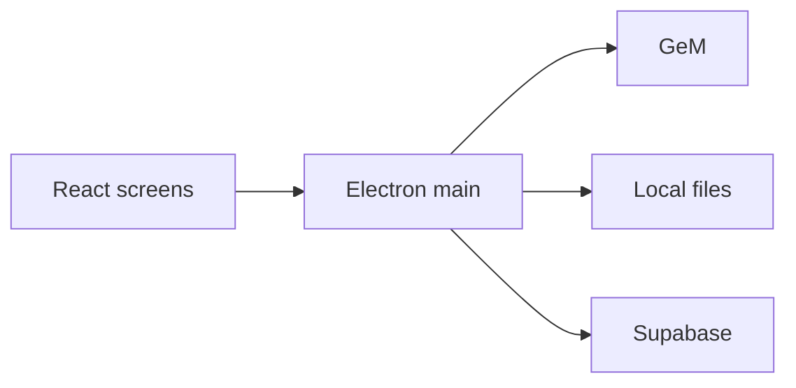
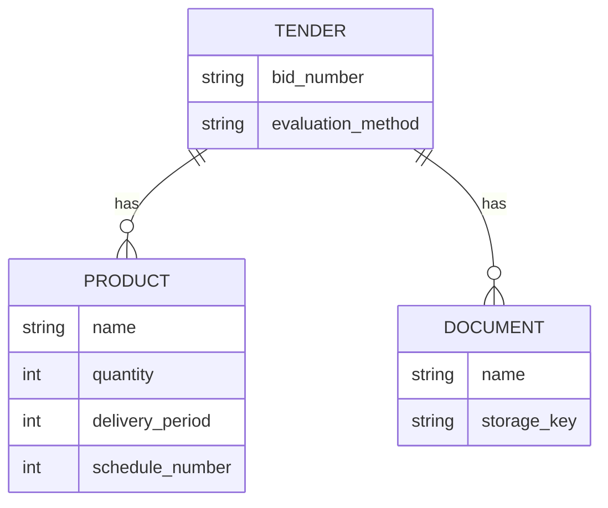

# Architecture Spine — GeM Tender Panel

## Design Paradigm

Cache-aside. Supabase is the shared record. Each installed app keeps a local file cache. The screens read the shared record. They use a local file when it is present, and the user can pull a missing file from Supabase.

The Electron main process is the only code that talks to GeM, the local disk, and Supabase. The React screens talk only to that process.



## Invariants and Rules

### AD-1 — One process owns the outside world [ADOPTED]

- **Binds:** all
- **Prevents:** the screens and the fetch each calling GeM or Supabase on their own
- **Rule:** React calls the Electron main process only. The main process performs GeM fetches, PDF parsing, local file reads and writes, and all Supabase reads and writes.

### AD-2 — Search lists first, then downloads [ADOPTED]

- **Binds:** search
- **Prevents:** a keyword search downloading every PDF before the user can see the list
- **Rule:** A search sends the keyword and a page count to GeM and does not download PDFs in that step. PDF downloads run in the background. The screens stay usable while that work runs.

### AD-3 — Bid number is the identity [ADOPTED]

- **Binds:** search
- **Prevents:** a second GeM download of a bid that already has a row, including after the local file was deleted
- **Rule:** The GeM bid number is the unique key. If Supabase already has that bid number, do not download it from GeM again. Write the row only after the PDF bytes are on local disk and the metadata is parsed. A failed download leaves no row, so the next search tries again. The listing id used to download the file is stored on the shared row. A local filesystem path is not stored in Supabase.

### AD-4 — The limit is pages, and it moves forward [ADOPTED]

- **Binds:** search
- **Prevents:** every later search rereading the same first pages and finding nothing new
- **Rule:** The limit is how many GeM pages to search, not how many new PDFs to guarantee. For each keyword, Supabase stores how many pages have already been searched. The next search continues after those pages. Known bid numbers on the new pages are skipped.

### AD-5 — Downloaded and saved are different [ADOPTED]

- **Binds:** search, saved
- **Prevents:** treating every downloaded PDF as saved, or capping the shared tender rows
- **Rule:** Supabase tender rows have no count limit. Unsaved PDFs live only in a local cache capped at 1000 files. Saving a tender keeps that PDF on the machine and outside the cap, and uploads it to Supabase Storage in the background. Unsaving returns the local file to the cache. If the cache is full, that local file is deleted. The Supabase row and the uploaded PDF remain.

### AD-6 — Records upload immediately [ADOPTED]

- **Binds:** tender-status
- **Prevents:** a contract or CRAC existing on only one machine with no shared copy
- **Rule:** A document the user uploads, including the contract and the CRAC, is written to Supabase Storage immediately and a copy is written on this machine. It does not count toward the unsaved PDF cap.

### AD-7 — A missing file is a user download [ADOPTED]

- **Binds:** saved, tender-status
- **Prevents:** a missing local file triggering a new GeM fetch, or the app pretending the file is present
- **Rule:** If the local file is present, use it. If it is not, say it is not on this machine and let the user download it from Supabase. That download does not contact GeM.

### AD-8 — Product rows follow the evaluation method [ADOPTED]

- **Binds:** search
- **Prevents:** one product shape for both PDF layouts, which drops lines or merges two schedules
- **Rule:** Store the evaluation method on the tender. A total-value product is one row per named block: name, that product's quantity, delivery period. The header total quantity is not the product quantity. An item-wise product is one row per schedule: schedule number, item code as the name, schedule quantity, delivery period. The same code may be two rows. Specification text is not stored.

### AD-9 — Three screens [ADOPTED]

- **Binds:** all
- **Prevents:** a fourth screen, or a separate fetch page
- **Rule:** The only screens are Search, Saved, and Tender Status. Search takes a keyword and a page limit and shows tenders from Supabase. Saved shows tenders the user saved. Tender Status shows filled tenders, their status, and the uploaded record files. Filters sit above the list on every screen: state, evaluation method, MSE, and EMD. Opening a bid replaces that list with the tender: stored fields, products, and documents. Back returns to the same list. It is not a fourth screen. A file on this machine is Ready. A file held for this bid but missing here is Download. A document the user has not added yet is Upload. The screen copy never names storage, sync, machines, folders, or the database.

### AD-10 — One folder per bid [ADOPTED]

- **Binds:** search, saved, tender-status
- **Prevents:** the GeM PDF and the uploaded records being stored in different trees
- **Rule:** Local files for a bid live in one folder named with that bid number, slashes replaced by hyphens, under the app data directory. Every file for that bid, including the GeM PDF, the contract, and the CRAC, is inside that folder's `documents` directory. The app checks there for a local copy.

### AD-11 — The screen reads stored rows [ADOPTED]

- **Binds:** all
- **Prevents:** the screen waiting on GeM, a PDF parse, or a fixed pause between requests
- **Rule:** The list, the filters, and an opened tender read stored rows only. Those reads use an index on bid number and on the filter fields. The PDF is parsed once, when the row is first written. Listing the next page and downloading PDFs from the page just found run at the same time. Each PDF is parsed as it arrives, and its row appears then. Downloads run several at a time, with no fixed pause. A failed download is retried on a later search. It does not stall the list.

## Consistency Conventions

| Concern | Convention |
| --- | --- |
| Code | The smallest path that does the job. No repeated structure, no comments that restate the code, no extra layers. |
| Screen copy | The user never sees storage, sync, machines, folders, or database names. A missing file is "Download". A present file is "Ready". |
| Tender fields | Bid number, listing id, bid end, offer validity, ministry or state, department, buyer email, HOD email, evaluation method, type of bid, bid to RA, RA qualification rule, payment timeline in days, whether bidder documents are shown, the required-document names from the PDF, MSE and MII preference with L1-plus percent and quantity percent when printed, EMD required and amount, ePBG required, percentage, and months, beneficiary name. |
| Left out of the row | Organisation, office, opening date, header total quantity, the raw item-category string, BOQ title, estimated value, inspection, turnover, experience, past performance, consignee, address, advisory bank, shelf life, specification text, GeM legal paragraphs, and any local file path. |
| Files | One local folder per bid number. All of that bid's files are in its `documents` folder. Saved PDFs and uploaded records are also in Supabase Storage. |

## Stack

| Name | Version |
| --- | --- |
| Electron | 44.7.0 |
| React | 19.3.0 |
| Vite | 8.3.3 |
| TypeScript | 7.0.2 |
| @supabase/supabase-js | 2.117.3 |
| pdfjs-dist | 6.4.299 |

## Structural Seed

The installed app is Electron on each machine. Supabase is the hosted Postgres database and file storage. There is no separate server to run. GeM is an external site, fetched with the public bid list and the bid PDF. No GeM login.

```text
app/
  src/          # React: Search, Saved, Tender Status
  electron/     # main process: GeM, pdfjs, local files, Supabase

<app data>/
  GEM-2026-B-8059746/
    documents/  # GeM PDF, contract, CRAC, and the other files for this bid
```



## Capability Map

| Capability | Lives in | Governed by |
| --- | --- | --- |
| Search | electron fetch, Search screen | AD-2, AD-3, AD-4, AD-5 |
| Saved | Supabase row, local PDF, Supabase Storage | AD-5, AD-7 |
| Tender Status | Supabase row, uploaded files | AD-6, AD-7, AD-9 |
| Products | Supabase product rows | AD-8 |

## Deferred

- Which unsaved local PDF is deleted when a new GeM download needs a free cache slot. Unsave already deletes the file just unsaved when the cache is full. A new download that would pass 1000 unsaved PDFs is skipped and leaves no row.
- Download template on each document except the GeM PDF. Later, that download is a template prefilled with the bid number, the products, and the other stored tender fields. The template files themselves are not part of this build.
- Accounts and billing. The app may be sold later. Supabase already holds the shared rows, so a login can be added without moving the data.
